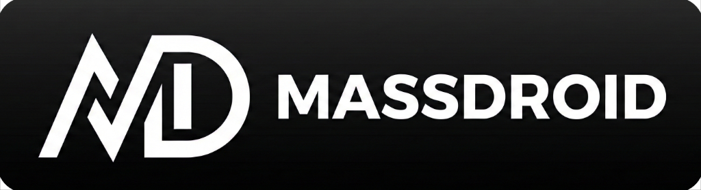
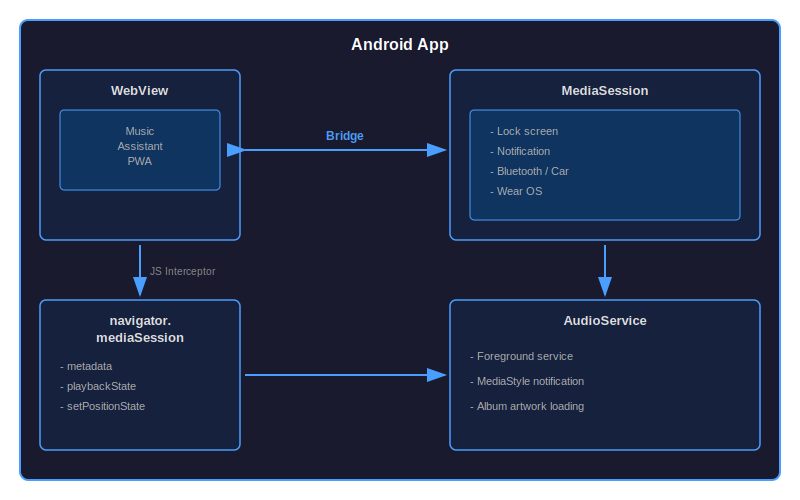

<p align="center">
  
</p>

<p align="center">
  <a href="https://www.buymeacoffee.com/sfortis" target="_blank">
    
  </a>
</p>

# MassDroid - Android Companion App for Music Assistant

MassDroid is a native Android application that wraps the [Music Assistant](https://music-assistant.io/) web interface, providing seamless integration with Android's native media controls. Control your music from the lock screen, notification shade, Bluetooth headphones, car stereo, or Wear OS watch.

## Why MassDroid?

You can access Music Assistant from any browser, but a native Android app offers real advantages:

| Feature | Browser | MassDroid |
|---------|---------|-----------|
| **Basic playback & UI** | Yes | Yes |
| **Lock screen with album art** | Yes | Yes |
| **Pause from lock screen** | Yes | Yes |
| **Next/Previous/Seek from lock screen** | No | Yes |
| **Bluetooth hardware buttons** | Unreliable | Yes |
| **Car stereo controls** | Unreliable | Yes |
| **Background playback** | Unreliable (Android may kill browser) | Reliable (foreground service) |
| **Auto-play on Bluetooth connect** | No | Yes |
| **Auto-resume after network change** | No | Yes |
| **Wear OS support** | No | Yes |
| **Dedicated app icon** | Bookmark only | Native app |
| **Full-screen UI** | Browser chrome visible | Clean, no distractions |

**In short:** Browser works for basic use. MassDroid adds reliable background playback, full media controls, and smart automation features.

## Features

- **Full Music Assistant UI** – Access the complete Music Assistant web interface in a native Android shell.
- **Native Media Controls** – Control playback from lock screen, notification shade, Bluetooth devices, and Wear OS.
- **Album Artwork** – Beautiful album art displayed in notifications and on lock screen.
- **Seekable Progress Bar** – Track progress with native seek support.
- **Auto-play on Bluetooth** – Automatically resume playback when connecting to Bluetooth audio devices.
- **Auto-resume on Network Change** – Seamless playback continuation when switching between WiFi and mobile data.
- **Dark Mode Support** – Follows system theme automatically.
- **Configurable Server URL** – Connect to any Music Assistant server.

## Architecture

MassDroid uses a JavaScript interceptor bridge to connect the Music Assistant PWA with Android's native MediaSession API:

<p align="center">
  
</p>

### How the Bridge Works

1. **JavaScript Injection** – On page load, MassDroid injects a JavaScript interceptor that hooks into `navigator.mediaSession`.

2. **Metadata Flow (PWA → Android)**:
   ```
   PWA updates navigator.mediaSession.metadata
        ↓
   JS Interceptor captures the change
        ↓
   AndroidMediaSession.updateMetadata() called via @JavascriptInterface
        ↓
   Native MediaSession + Notification updated
   ```

3. **Playback Control Flow (Android → PWA)**:
   ```
   User taps play on Bluetooth/notification
        ↓
   MediaSession callback triggered
        ↓
   executeMediaCommand() calls JavaScript
        ↓
   window.musicPlayer.play() invokes PWA handler
   ```

4. **Position/Seek Flow**:
   ```
   PWA calls navigator.mediaSession.setPositionState()
        ↓
   JS Interceptor captures position data
        ↓
   AndroidMediaSession.updatePositionState() updates progress bar

   User seeks via notification
        ↓
   MediaSession.onSeekTo() callback
        ↓
   window.musicPlayer.seekTo(position) called
   ```

## Installation

### Option 1: Download APK (Recommended)

1. Download the latest APK from the [Releases](https://github.com/sfortis/massdroid/releases) page.
2. Install on your Android device (enable "Install from unknown sources" if needed).
3. On first launch, enter your Music Assistant server URL.

### Option 2: Build from Source

```bash
git clone https://github.com/sfortis/massdroid.git
cd massdroid
./gradlew assembleRelease
```

The APK will be at `app/build/outputs/apk/release/app-release.apk`

## Requirements

- Android 8.0 (Oreo) or higher
- A running [Music Assistant](https://music-assistant.io/) server

## Configuration

Access settings from the navigation drawer (hamburger menu):

| Setting | Description |
|---------|-------------|
| **Music Assistant URL** | Your server URL (e.g., `https://mass.example.com`) |
| **Keep Screen On** | Prevent screen timeout while app is open |
| **Auto-play on Bluetooth** | Resume playback when Bluetooth audio connects |
| **Auto-resume on Network** | Resume after WiFi/mobile data switch |

## Permissions

| Permission | Purpose |
|------------|---------|
| `INTERNET` | Connect to your Music Assistant server |
| `BLUETOOTH_CONNECT` | Detect Bluetooth audio connections |
| `FOREGROUND_SERVICE` | Keep playing music in background |
| `POST_NOTIFICATIONS` | Show media notification with controls |

## Troubleshooting

**Media controls not responding?**
- Ensure the Music Assistant web player is active
- Check that notification permissions are granted

**No audio after network change?**
- Enable "Auto-resume on Network" in settings
- The app will automatically reconnect when network is restored

**Bluetooth auto-play not working?**
- Enable "Auto-play on Bluetooth" in settings
- Grant Bluetooth permissions when prompted

## Contributing

Contributions are welcome! Please feel free to submit a Pull Request.

## License

This project is licensed under the GNU General Public License v3.0 - see the [LICENSE](LICENSE) file for details.

## Acknowledgments

- [Music Assistant](https://music-assistant.io/) – The amazing self-hosted music server
- [SendSpin](https://github.com/music-assistant/sendspin) – Audio streaming protocol used by Music Assistant

## Support

If you encounter any issues, please [open an issue](https://github.com/sfortis/massdroid/issues) on GitHub.
